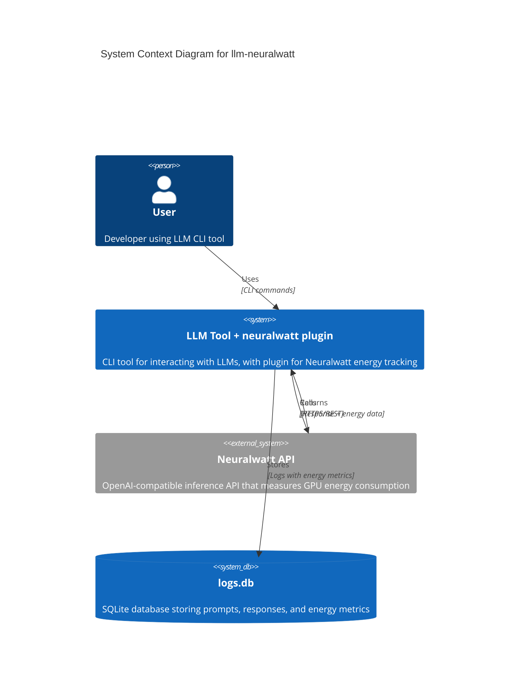
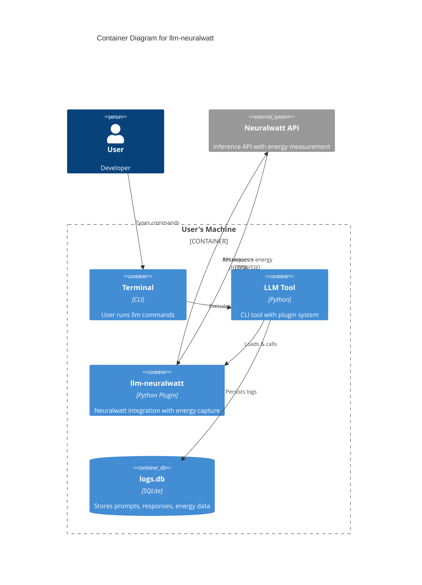
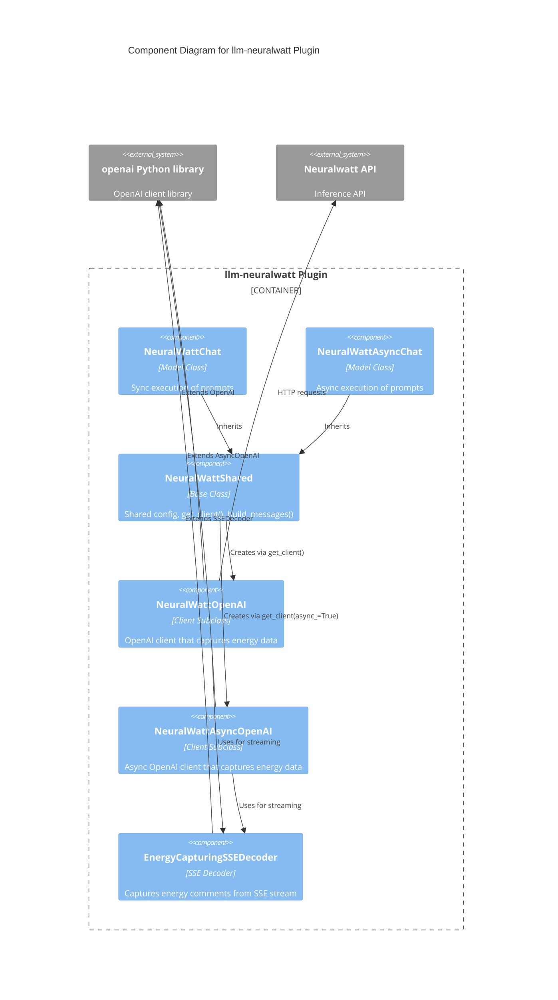
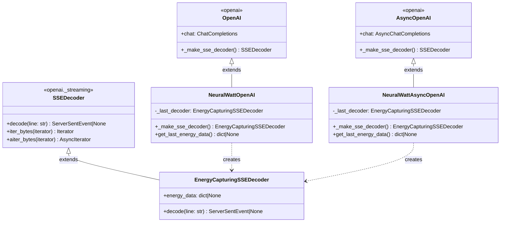
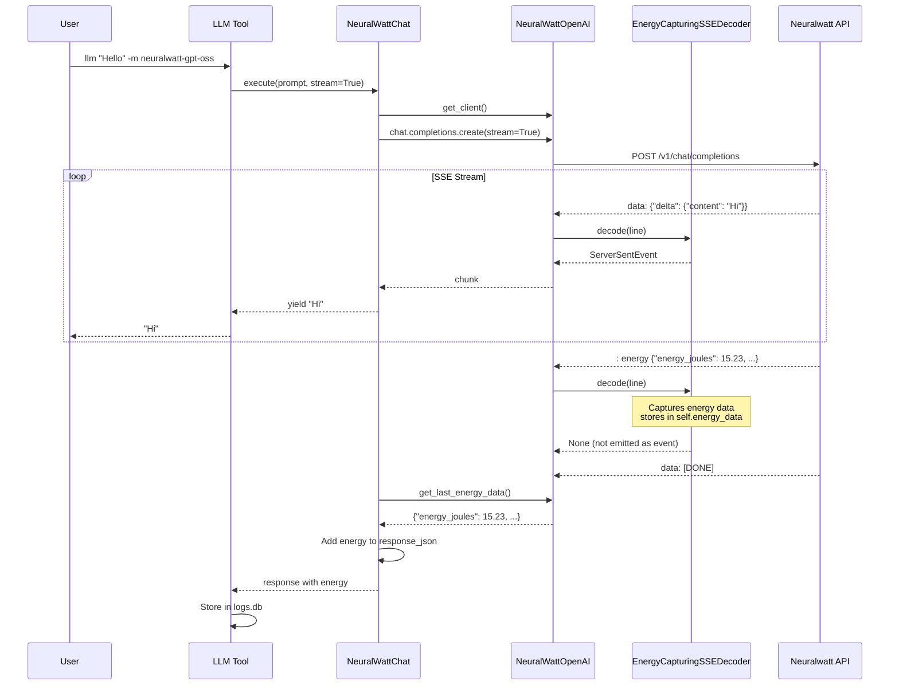

# Architecture: Energy Data Collection in llm-neuralwatt

This document explains how the llm-neuralwatt plugin captures energy consumption data from the Neuralwatt API, including both streaming and non-streaming modes.

## Overview

Neuralwatt is an OpenAI-compatible inference API that measures and reports the energy consumption of each request. This plugin integrates with Simon Willison's [LLM](https://llm.datasette.io/) tool to make Neuralwatt models available and persist energy data in LLM's local SQLite database.

## C4 Model Diagrams

### Context Diagram

Shows the system's relationship with users and external systems.



### Container Diagram

Shows the high-level components and how they interact.



### Component Diagram

Shows the internal components of the llm-neuralwatt plugin.



### Class Diagram

Shows the inheritance hierarchy for energy capture.



## How Energy Data is Transmitted

### Non-Streaming Mode

In non-streaming mode, Neuralwatt includes energy data directly in the JSON response:

```json
{
  "id": "chatcmpl-abc123",
  "choices": [{"message": {"content": "Hello!"}, "finish_reason": "stop"}],
  "usage": {"prompt_tokens": 10, "completion_tokens": 5},
  "energy": {
    "energy_joules": 15.23,
    "energy_kwh": 4.23e-06,
    "avg_power_watts": 78.5,
    "duration_seconds": 0.194,
    "attribution_method": "prorated",
    "attribution_ratio": 1.0
  }
}
```

The standard OpenAI client parses this correctly, and LLM stores it in `response_json`.

### Streaming Mode

In streaming mode, Neuralwatt uses Server-Sent Events (SSE). The challenge is that energy data arrives as an **SSE comment** just before `[DONE]`:

```
data: {"choices": [{"delta": {"content": "Hello"}}]}
data: {"choices": [{"delta": {"content": "!"}}]}
data: {"choices": [], "usage": {...}}
: energy {"energy_joules": 15.23, "energy_kwh": 4.23e-06, ...}
data: [DONE]
```

Per the [SSE specification](https://html.spec.whatwg.org/multipage/server-sent-events.html), lines starting with `:` are comments and should be ignored. The standard OpenAI client follows this spec:

```python
# From openai/_streaming.py
def decode(self, line: str) -> ServerSentEvent | None:
    if line.startswith(":"):
        return None  # Comments are ignored
```

### Our Solution: Custom SSE Decoder

We subclass the SSE decoder to capture energy comments before they're discarded.

## Data Flow: Streaming Request



## Energy Data Fields

Each energy measurement from Neuralwatt includes:

| Field | Type | Description |
|-------|------|-------------|
| `energy_joules` | float | Total energy consumed in joules |
| `energy_kwh` | float | Total energy consumed in kilowatt-hours |
| `avg_power_watts` | float | Average power draw during inference |
| `duration_seconds` | float | Time taken for the request |
| `attribution_method` | string | How energy was attributed (e.g., "prorated") |
| `attribution_ratio` | float | Ratio of total GPU energy attributed to this request |

For more details on attribution methodology, see the [Neuralwatt documentation](https://portal.neuralwatt.com/docs/energy-methodology).

## Why Subclass Instead of Replace?

We considered replacing the OpenAI client with raw `httpx` requests, but subclassing preserves:

- **Automatic retries** with exponential backoff
- **Timeout handling** with sensible defaults
- **Proxy support** via environment variables
- **Debug logging** via `LLM_OPENAI_SHOW_RESPONSES`
- **Custom headers** support
- **Type safety** with Pydantic response models

The subclass approach requires only ~60 lines of code vs ~200 for a full replacement.
